# Algorithm Performance Measurement and Benchmarking Tool

Lab Assignment 2 for ENCA351 Design and Analysis of Algorithms Lab, BCA (AI&DS) Semester V.

A Python tool that runs algorithms and code snippets at chosen input sizes and reports
execution time, memory usage and the number of basic operations. A Streamlit web app
wraps the modules, an automated engine repeats every experiment across the input sizes
from the assignment, and the results feed charts, a complexity table and a written
comparison.

| | |
|---|---|
| Student | Shreyansh Vaibhaw |
| Roll number | 2401201094 |
| Repository | `algorithm-performance-tool-shreyansh` |
| Faculty | Dr. Aarti |

## What the tool does

- **Search analysis** (Task 2). Generate a dataset of any size, pick a key, and run linear
  search and binary search. Each run reports the result, the number of key comparisons,
  execution time and memory.
- **Code benchmarking** (Task 3). Run single loop traversal, nested loop traversal,
  recursive factorial and iterative factorial side by side, with an execution time
  report, a memory report and a comparison table.
- **Automated benchmarking** (Task 4). One engine runs every algorithm across the
  assignment's sizes: searches at 100 / 1,000 / 10,000 / 50,000 elements, factorials at
  n = 100 / 500 / 1,000, loops at 100 / 1,000 / 10,000 / 50,000 iterations.
- **Visualization** (Task 5). Input size against time and memory for each pair of
  algorithms, a comparisons chart for the searches, a log-log overview and a chart of the
  observed growth exponents.
- **Complexity analysis** (Task 6). Theoretical time and space complexity next to the
  measured time, memory and fitted growth trend.
- **Comparative study** (Task 7). Speed-up tables and a discussion of each comparison.

## Project structure

```
app.py                  Streamlit web app (all seven pages)
search_analysis.py      linear and binary search with comparison counting, dataset generation
code_benchmark.py       the four code snippets with operation counts
benchmark_engine.py     timing, memory measurement, the automated suite, CSV output
complexity_analysis.py  theoretical table, growth-exponent fit, theory-vs-observed table
visualization.py        matplotlib charts and plain-language trend summaries
run_benchmarks.py       one command: suite -> results/ -> graphs/ -> complexity table
project_notebook.ipynb  the whole study as a Jupyter notebook, executed with outputs
requirements.txt        streamlit, pandas, matplotlib, memory_profiler, numpy, jupyter
results/                benchmark_results.csv, complexity_table.csv, growth_factors.csv,
                        trend_summary.txt, environment.json (reference run)
graphs/                 charts rendered from the reference run
screenshots/            the web app's pages
report/                 final report
```

## Setup

```bash
git clone <your repository url>
cd algorithm-performance-tool-shreyansh
python -m venv venv
venv\Scripts\activate          # Windows
source venv/bin/activate       # macOS / Linux
pip install -r requirements.txt
```

Python 3.10 or newer. The reference run used CPython 3.12.10 on Windows 11.

## Running it

Web app:

```bash
streamlit run app.py
```

Whole experiment from the command line (writes `results/` and `graphs/`):

```bash
python run_benchmarks.py
```

The full run takes about six minutes because the nested loop at 50,000 iterations
executes 2.5 billion inner steps. `python run_benchmarks.py --quick` caps it at 10,000
and finishes in about twenty seconds.

Notebook:

```bash
jupyter notebook project_notebook.ipynb
```

Each module also runs on its own as a quick self-test, for example `python search_analysis.py`.

## How the measurements are made

- **Time.** `time.perf_counter()` around the call. The call is repeated until there are at
  least five samples covering 50 ms, or a 3 s budget is used up, and the median is
  reported. Garbage collection is paused during timing, as `timeit` does. Dataset
  generation happens before the clock starts.
- **Memory.** Peak extra heap allocated during one separate run traced with
  `tracemalloc`. Timing and tracing never share a run: tracing every allocation slowed
  the loops 25x to 60x on the test machine, so a traced run would measure the profiler.
- **Skipped traces.** The engine predicts how long a traced run would take from the
  untraced time and the measured overhead factor. Above a 30 s budget it skips the memory
  pass and records the reason in the `memory_method` column. This happens for the nested
  loop at 10,000 and 50,000 iterations; tracing the largest case would take hours. Its
  O(1) memory is confirmed at 100 and 1,000 iterations.
- **Operations.** Key comparisons for the searches (one per probe for binary search),
  iterations, multiplications or recursive calls for the snippets.
- **memory_profiler** is available as a second backend. It reads the whole process's
  resident set size through `psutil` from a sampling thread. Page granularity means it
  reports 0 KB for most of these algorithms, which is a useful contrast with the exact
  heap numbers from `tracemalloc`.
- **Recursion limit.** Python refuses to recurse past 1,000 frames by default, so the
  recursive factorial raises `sys.setrecursionlimit` for n >= 1,000. That the limit has
  to be touched at all is the practical face of its O(n) stack cost.

## Results of the reference run

Machine: Intel Core i5 class laptop (8 logical CPUs), Windows 11, CPython 3.12.10.
Searches use a sorted dataset and a key that is absent, the worst case for both.

| Algorithm | n = 100 | n = 1,000 | n = 10,000 | n = 50,000 |
|---|---|---|---|---|
| Linear Search | 10.5 us | 196.7 us | 1.66 ms | 10.18 ms |
| Binary Search | 3.6 us | 3.4 us | 4.9 us | 5.0 us |
| Single Loop Traversal | 7.0 us | 78.4 us | 866.2 us | 4.44 ms |
| Nested Loop Traversal | 691.1 us | 80.21 ms | 8.85 s | 328.99 s |

| Algorithm | n = 100 | n = 500 | n = 1,000 |
|---|---|---|---|
| Recursive Factorial | 21.0 us, 324 bytes | 228.2 us, 8.14 KB | 692.0 us, 23.77 KB |
| Iterative Factorial | 14.3 us, 324 bytes | 160.9 us, 1.15 KB | 558.5 us, 2.39 KB |

Key comparisons for an absent key: linear search needs n (100 to 50,000); binary search
needs 6, 9, 13 and 15.

| Algorithm | Theoretical time | Observed exponent | Trend | Verdict |
|---|---|---|---|---|
| Linear Search | O(n) | 1.09 | linear | matches theory |
| Binary Search | O(log n) | 0.06 | constant / logarithmic | matches theory |
| Recursive Factorial | O(n) | 1.51 | between linear and quadratic | faster growth than the bound |
| Iterative Factorial | O(n) | 1.58 | between linear and quadratic | faster growth than the bound |
| Single Loop Traversal | O(n) | 1.04 | linear | matches theory |
| Nested Loop Traversal | O(n^2) | 2.09 | quadratic | matches theory |

The observed exponent is the slope of log(time) against log(n) fitted across the
measured sizes.

What stands out:

- At 50,000 elements binary search is about 2,000 times faster than linear search, and the
  gap doubles every time the dataset doubles.
- The nested loop needed 5.5 minutes at 50,000 iterations against 4.4 ms for the single
  loop. Same n, 74,000 times the cost.
- The two factorials run within 1.2x of each other, but the recursive version's memory
  grows linearly with n (23.8 KB against 2.4 KB at n = 1,000) because every open call
  keeps its own integer argument alive.
- Both factorials grow faster than O(n) says they should. Python integers have arbitrary
  precision, 1000! has 2,568 digits, and multiplying numbers that long is not a
  constant-time step. The bound counts multiplications, not digits.

### Charts

| | |
|---|---|
| 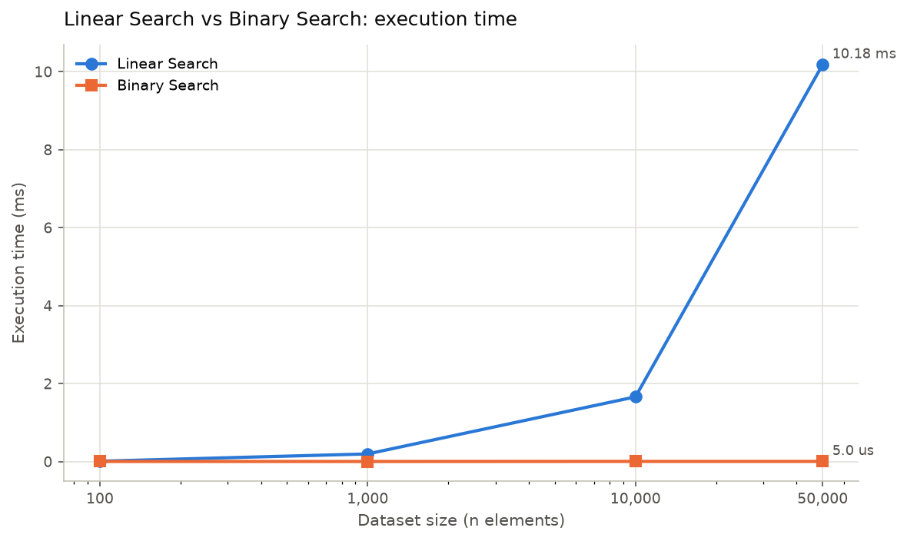 | 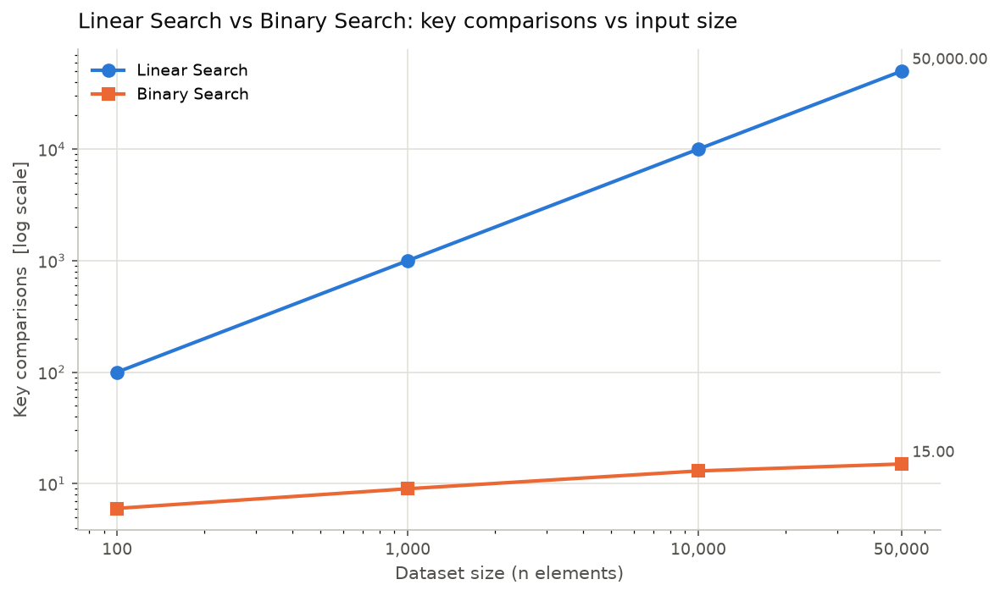 |
| 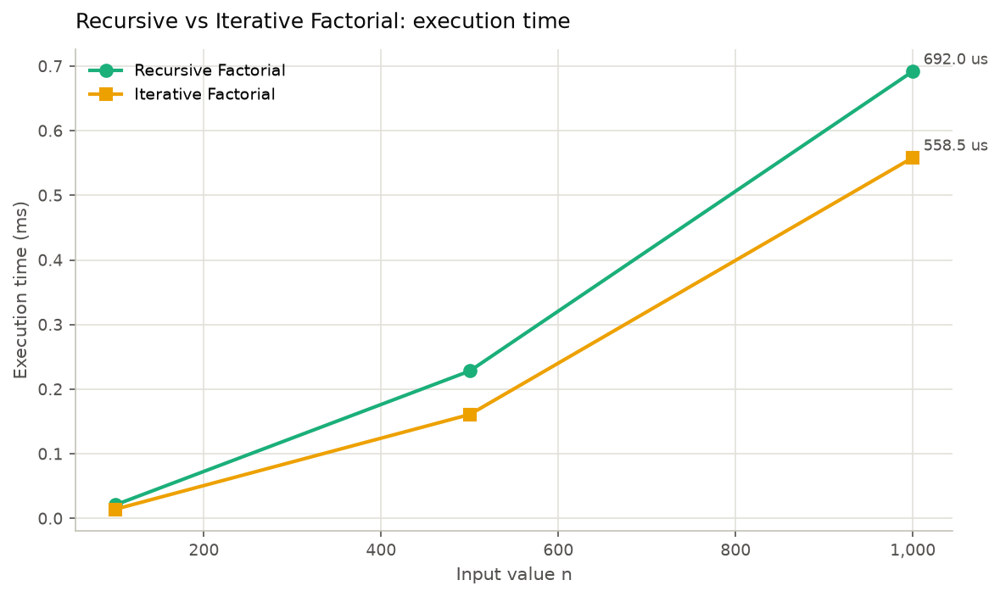 | 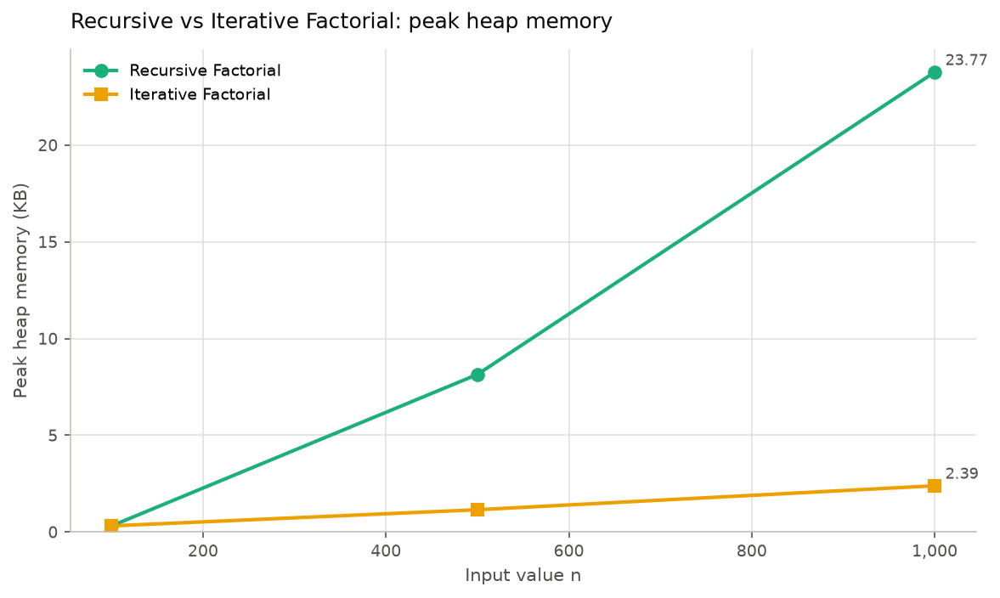 |
| 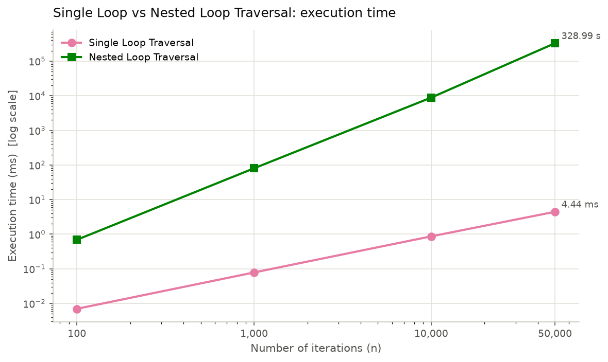 | 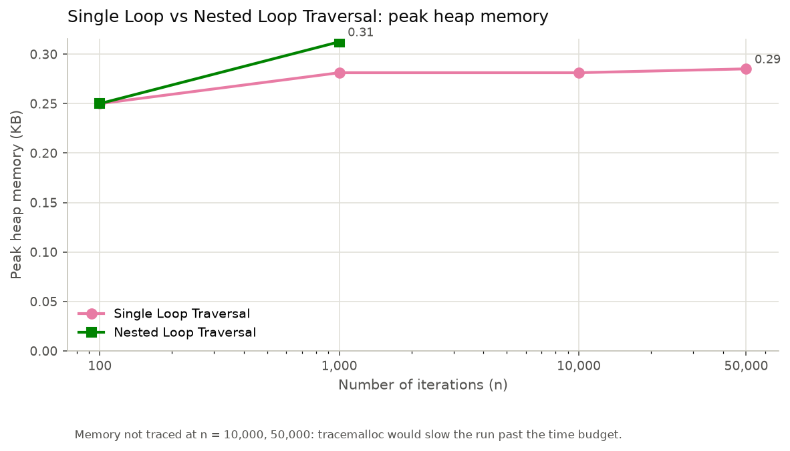 |
| 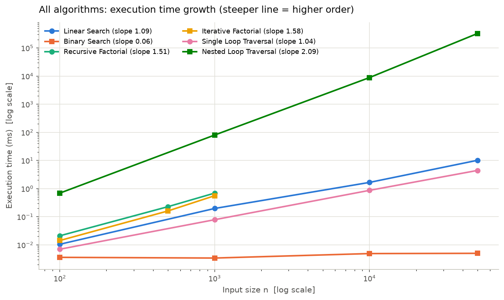 | 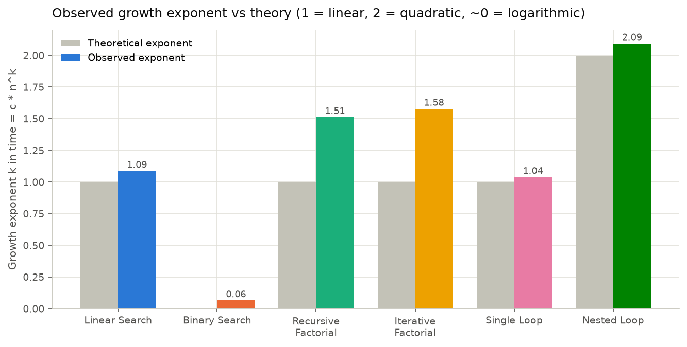 |

### Screenshots of the web app

| | |
|---|---|
| 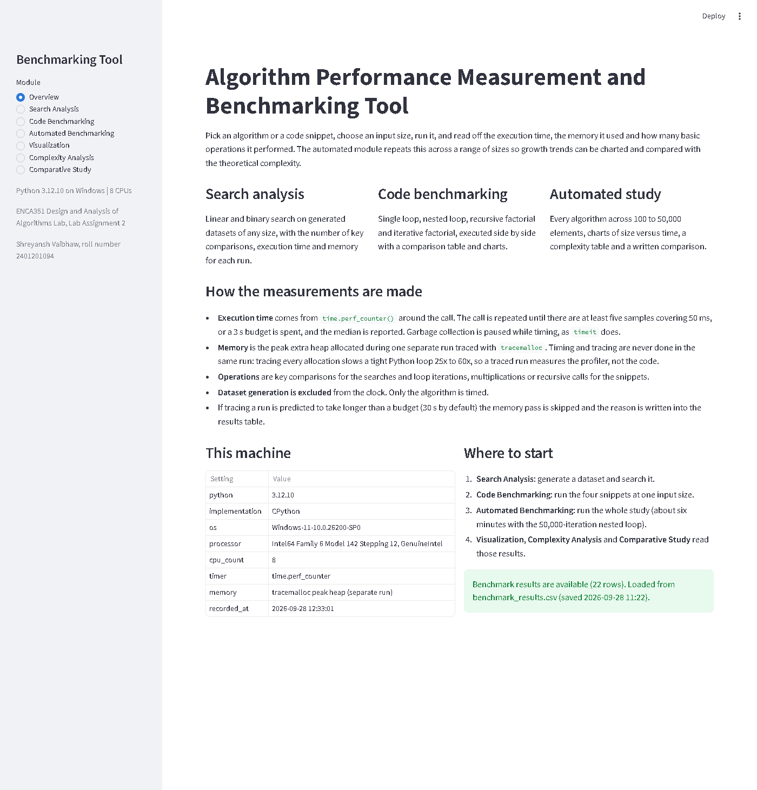 | 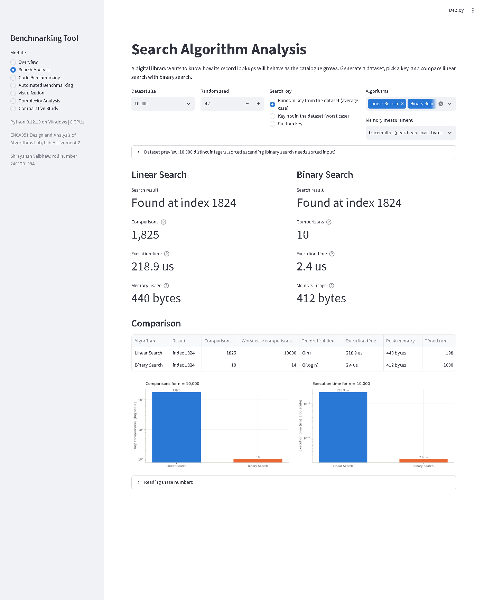 |
| 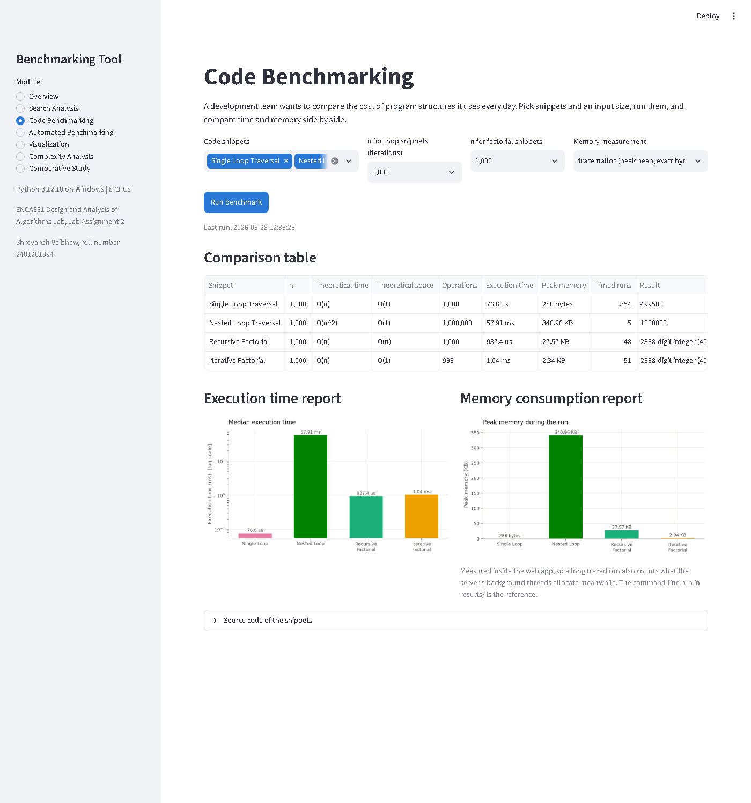 | 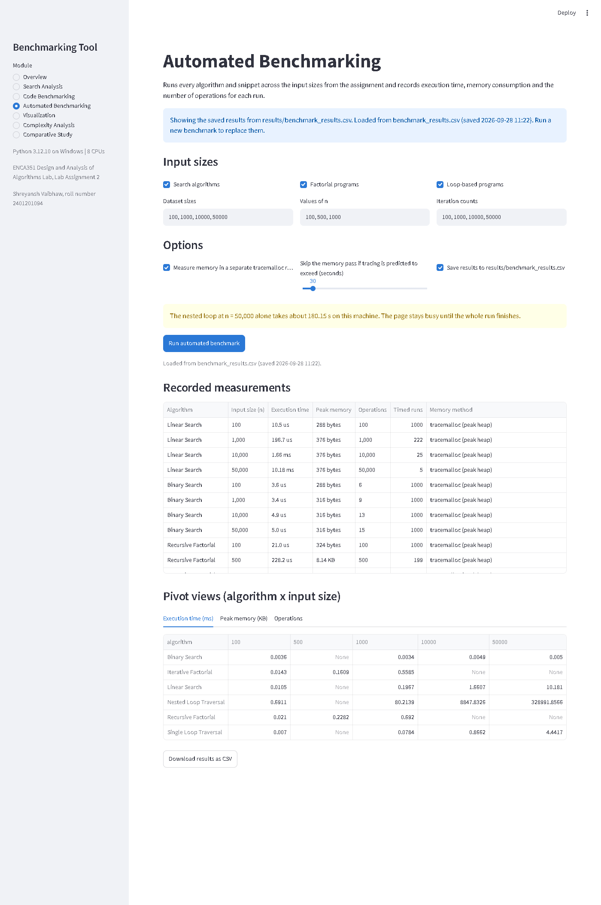 |
| 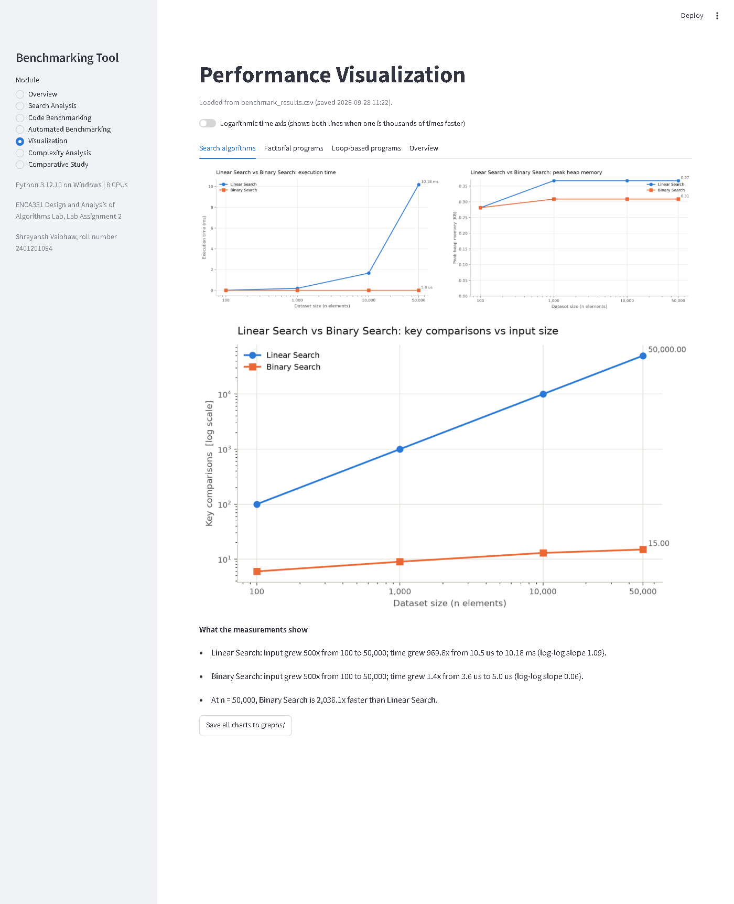 | 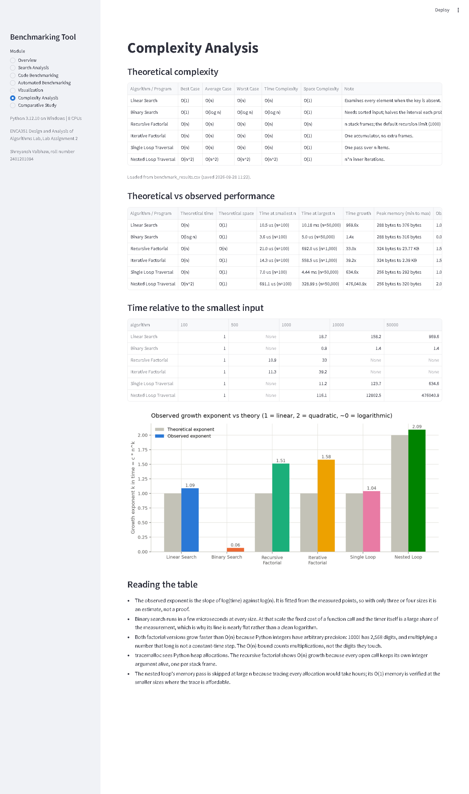 |
| 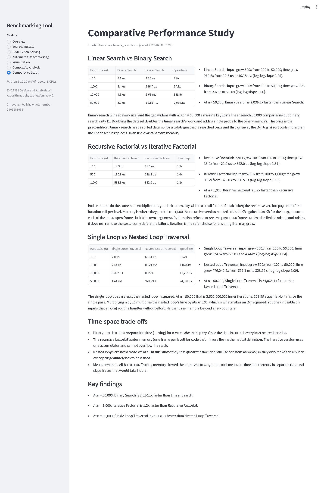 | |

## Final report

`report/Final_Report.docx` (and the same document as `report/Final_Report.pdf`) covers the
introduction, method, results, analysis and conclusion, with the tables, charts and
screenshots above.

## References

- Horowitz, E., Sahni, S. and Rajasekaran, S., *Fundamentals of Computer Algorithms*.
- Kleinberg, J. and Tardos, E., *Algorithm Design*.
- Python documentation: `time.perf_counter`, `tracemalloc`, `sys.setrecursionlimit`, `timeit`.
- Streamlit documentation, https://docs.streamlit.io
- memory_profiler documentation, https://github.com/pythonprofilers/memory_profiler
- Jupyter Notebook documentation, https://jupyter-notebook.readthedocs.io
